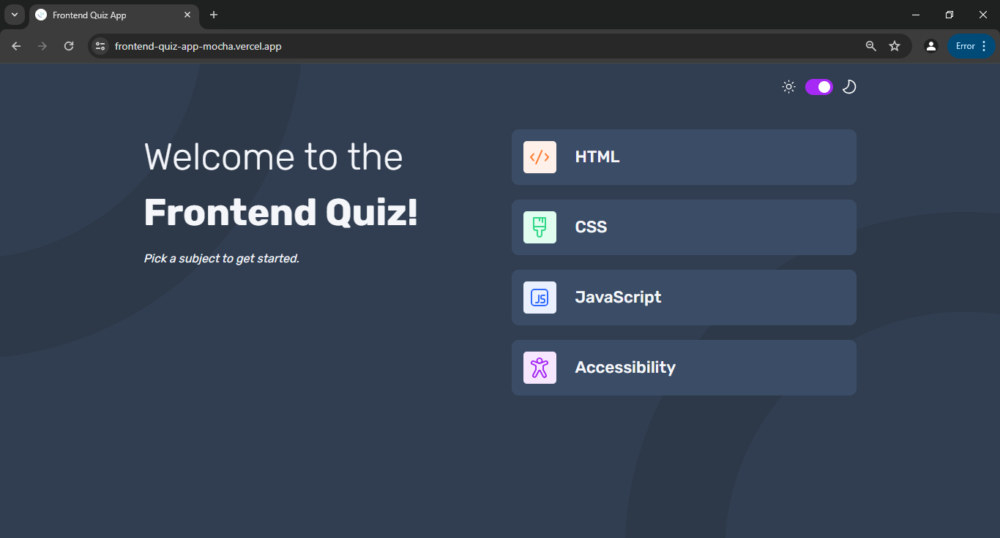
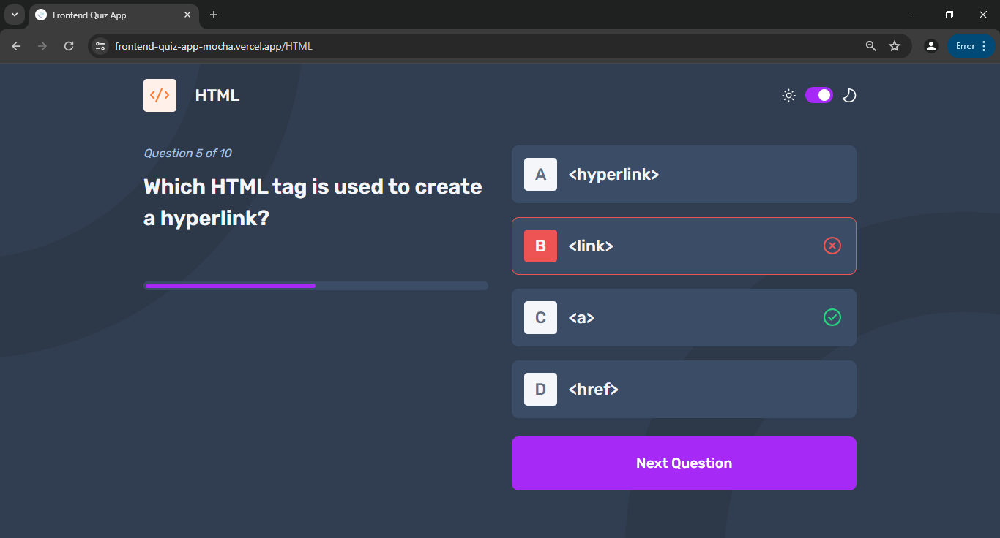
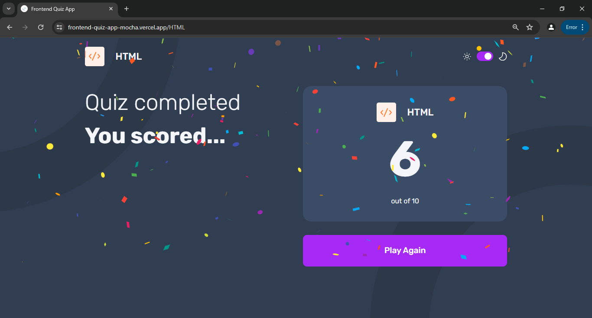
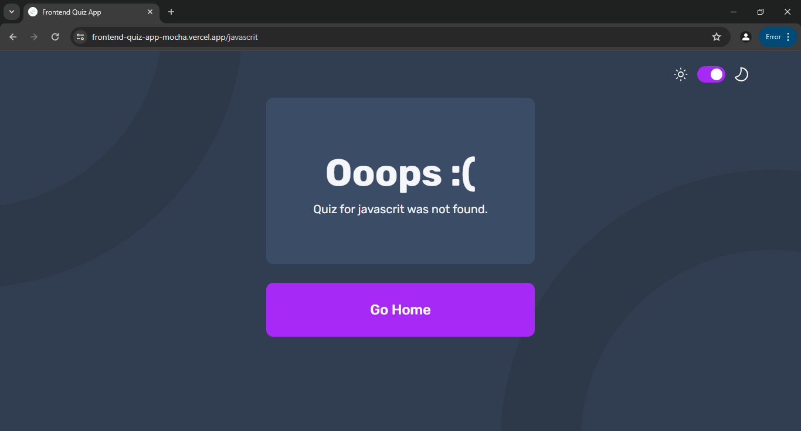
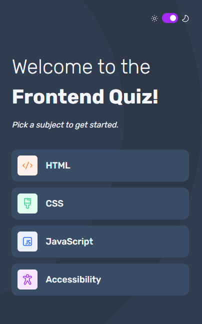
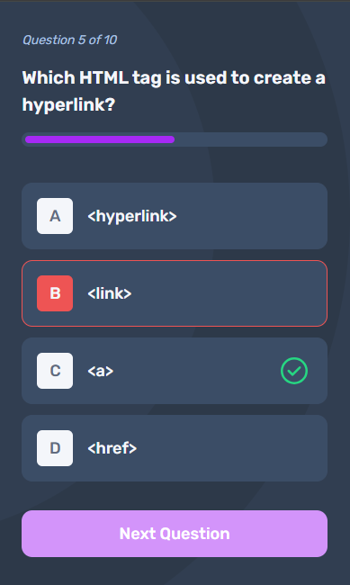
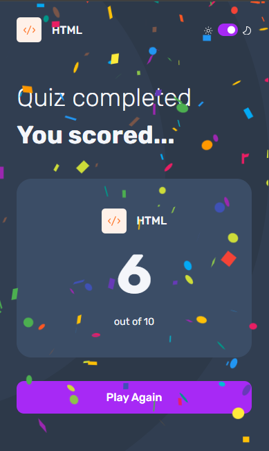
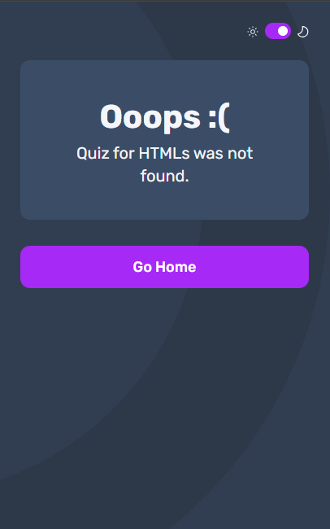

## Table of contents

- [Overview](#overview)
  - [The challenge](#the-challenge)
  - [Screenshot](#screenshot)
  - [Links](#links)
- [My process](#my-process)
  - [Built with](#built-with)
  - [What I learned](#what-i-learned)
  - [Continued development](#continued-development)
  - [Useful resources](#useful-resources)
- [Author](#author)

## Overview

This project is a solution to the evaluation project assigned to me during my  Pre-Selection Training for the AmaliTech National Service Program. The goal of this project was to create a fully functional quiz application where users can select a quiz subject, answer questions, see their results, and play again. The project also included making the app responsive and accessible for users who navigate using a keyboard or screen reader.

### The challenge

Users should be able to:

- Select a quiz subject
- Select a single answer from each question from a choice of four
- See an error message when trying to submit an answer without making a selection
- See if they have made a correct or incorrect choice when they submit an answer
- Move on to the next question after seeing the question result
- See a completed state with the score after the final question
- Play again to choose another subject
- View the optimal layout for the interface depending on their device's screen size
- See hover and focus states for all interactive elements on the page
- Navigate the entire app only using their keyboard
- **Bonus**: Change the app's theme between light and dark

### Screenshot

#### Desktop Screenshots

#### Mobile Screenshots

### Links

- Solution URL: https://github.com/alhassan50/frontend-quiz-app/
- Live Site URL: https://frontend-quiz-app-mocha.vercel.app/

## My process

### Built with

- Mobile-first workflow
- Visual Studio Code - Integerated development environment
- [Framer Motion](https://www.framer.com/motion/) - Animation library
- Git and Github - For version control
- [Git Flow](https://www.atlassian.com/git/tutorials/comparing-workflows/gitflow-workflow) - Git branching model
- Node Package Manager - For installing and managing project dependencies
- [ReactJS](https://react.dev/) - JS UI library
- [React Router DOM](https://reactrouter.com/) - For client side routing
- [React Confetti](https://www.npmjs.com/package/react-confetti) - For animating confetti
- [Redux Toolkit](https://redux-toolkit.js.org/) - Sate management library
- [Styled Components](https://www.styled-components.com/) - For styles
- [Typsecript](https://www.typescriptlang.org/) - For clean and error free coding
- [Vercel](https://vercel.com/) - For cloud hosting

### What I learned

Working on this evaluation project was an enriching experience that allowed me to deepen my understanding of several key web development concepts and practices. Here are some of the most significant lessons I learned:

1.  React and State Management:

  - State Handling: I improved my skills in managing component state using React hooks, particularly useState and useEffect, to handle dynamic data and side effects.
  - Component Structure: I learned how to structure a React application with reusable components, making the codebase more maintainable and scalable.

2.  Styled Components:

  - CSS-in-JS: This project allowed me to explore styled-components for styling React components. I learned how to create styled components, use props to dynamically change styles, and manage theming for light and dark modes.
  - Responsive Design: I utilized media queries within styled components to ensure the application is responsive across various device sizes.

3.  Accessibility:

  - Keyboard Navigation: Implementing keyboard accessibility features taught me how to handle keyboard events in React. I ensured that users could navigate the app using the keyboard, enhancing the accessibility of the application.
  - ARIA Roles and Attributes: I learned about ARIA roles and attributes like 'tabIndex' to improve the accessibility of interactive elements, making the app usable for people relying on screen readers.

4.  React Router:

  - Navigation: I gained experience in using react-router-dom for handling navigation within the app. This included setting up routes and using the useNavigate hook for programmatic navigation.

5.  Redux Toolkit:

  - State Management: I used Redux for global state management, learning how to create slices, dispatch actions, and select state using the useSelector and useDispatch hooks.

6.  Debugging:

  - Deployment Errors and Warnings: Throughout the development process, I encountered and resolved several deployment errors and warnings, particularly those related to styled-components and TypeScript.
  
  - Fixing Errors: This involved ensuring that props intended for styling purposes did not get passed down to DOM elements, which can cause React to log warnings about unknown attributes. I also ensured the right types were created for variables used and found ways to prevent TypeScript errors related to unused variables. I learned to use tools and techniques such as React DevTools, Vercel's console, and debugging in the browser console to identify and fix these issues efficiently.

7.  Development Workflow:

  - Version Control: I practiced using Git Flow and GitHub for version control, managing branches, opening issues, and handling pull requests and merges effectively.
  - Code Reviews: Participating in self code reviews helped me improve my code quality and learn from my mistakes.

### Continued development

1.  GitHub and GitFlow:

  - I want to deepen my understanding of GitHub and explore more advanced features.
  - I aim to master GitFlow and explore alternative branching strategies to optimize my workflow and collaboration in larger teams.

2.  Complex Animations with Framer:

  - I am eager to learn more about creating complex animations using Framer Motion.
  - My goal is to build more interactive and engaging user interfaces by leveraging advanced animation techniques.

3.  React and React Router:

  - I plan to delve deeper into React to fully understand its capabilities and best practices.
  - I also want to explore more advanced features of React Router to handle complex routing scenarios in larger applications.

4.  Redux Toolkit:

  - I aim to gain a more thorough understanding of Redux Toolkit to manage global state more efficiently.
  - I want to explore advanced patterns and techniques for state management, including asynchronous actions and   middleware.

### Useful resources

- [Gitflow on GitHub: How to use Git Flow workflows with GitHub Based Repos](https://www.youtube.com/watch?v=WQuxeEvaCxs) - This YouTube video helped me understand how to implement Git Flow workflows with GitHub repositories. The clear explanations and practical examples made it easy to follow and apply in my own project. I will use it going forward.

- [Git and GitHub Tutorials #5 - Understanding GitHub Issues](https://www.youtube.com/watch?v=TKJ4RdhyB5Y) - This YouTube tutorial was invaluable in learning how to effectively use GitHub Issues. It covered everything from creating issues to managing and resolving them, which greatly improved my workflow and project management skills.

- [Making Confetti in React](https://akankshit.medium.com/making-confetti-in-react-63ad05ea118) - This Medium article provided a fun and practical guide on how to implement confetti effects in a React application. It was a great way to learn about animations and enhancing user experience with engaging visuals.

## Author

- Name: Abdullahi Alhassan Baaba
- Github - [@alhassan50](https://github.com/alhassan50)
- LinkedIn - [@alhassanbaaba](https://linkedin.com/in/alhassanbaaba/)